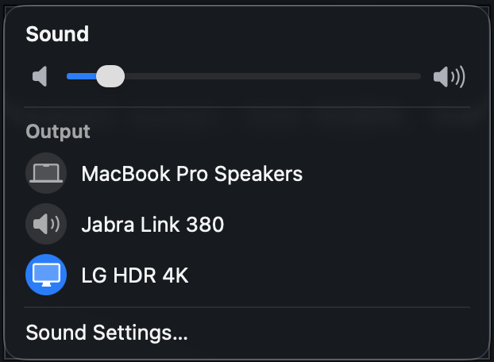

# SoundCtl

A pixel-faithful replica of the macOS 26 (Tahoe / Liquid Glass) menu-bar **Sound**
popover that **also controls the volume of external monitors over DDC/CI** — so the
familiar habit of changing volume from the menu bar (and with the hardware volume
keys) works for displays that macOS normally leaves greyed-out.



## Why

macOS can't set the volume of most external displays: their audio is a digital
passthrough (HDMI / DisplayPort), so the system volume slider and the hardware
volume keys are disabled. Monitors *can* be controlled over **DDC/CI** (the same
channel used by [BetterDisplay](https://github.com/waydabber/BetterDisplay) and
[MonitorControl](https://github.com/MonitorControl/MonitorControl)).

SoundCtl puts that control exactly where you expect it — the menu-bar Sound
popover and the volume keys — while looking and behaving like the real thing.

## Features

- **Native-looking Sound popover** built with SwiftUI on the real Liquid Glass
  material (`NSGlassEffectView`): the same title, volume slider, output device
  list, and "Sound Settings…" row, matched down to fonts, spacing, and colours.
- **DDC volume for displays** — when a DDC-capable monitor is the selected
  output, the slider drives it over VCP `0x62` instead of being greyed out.
- **Hardware volume keys for displays** — the volume up / down / mute keys adjust
  the monitor over DDC and show a native-style on-screen **volume HUD**, *only*
  when macOS can't do it itself and **BetterDisplay isn't running** (it defers to
  BetterDisplay automatically).
- **Faithful menu-bar icon** — variable speaker that tracks the level, switches to
  a headphones glyph for headphone output, and a slash when muted.
- **Output switching**, virtual-device filtering (e.g. Teams Audio is hidden),
  and the dynamic device icons (MacBook, display, headphones…).
- **Launch at Login** and **Quit** from the right-click menu.

## Requirements

- macOS 26 (Tahoe) or later — the popover uses `NSGlassEffectView` (Liquid Glass).
- Apple Silicon (DDC is implemented via the private `IOAVService`, as in
  MonitorControl/BetterDisplay).
- Swift toolchain (Xcode or the Command Line Tools). No Xcode project is required —
  the app builds with Swift Package Manager.

## Build & run

```bash
# Build and run the self-test suite
scripts/test.sh

# Build a release .app bundle into ./build
scripts/build_app.sh release
open build/SoundCtl.app
```

## Install

```bash
scripts/install.sh        # builds release and installs to /Applications
```

Installing to **/Applications** is recommended: *Launch at Login* (`SMAppService`)
and the volume-key Accessibility grant register reliably only for an app in
/Applications.

> The app is ad-hoc signed. On first launch Gatekeeper may warn that it's from an
> unidentified developer — right-click the app and choose **Open**, or clear the
> quarantine flag with `xattr -dr com.apple.quarantine /Applications/SoundCtl.app`.

## Usage

- **Left-click** the menu-bar icon → the Sound popover (volume + output switching).
- **Right-click** (or control-click) the icon → Launch at Login / Quit, and
  **Grant Accessibility Access for Volume Keys…** until Accessibility is granted.

### Volume keys for displays (permission)

To let the hardware volume keys control a monitor, SoundCtl needs **Accessibility**
permission (to observe the media keys via a `CGEventTap`):

1. Right-click the menu-bar icon → **Grant Accessibility Access for Volume Keys…**
2. Enable **SoundCtl** under *System Settings → Privacy & Security → Accessibility*.
3. If the keys don't respond immediately, relaunch SoundCtl.

When the selected output is a DDC display **and BetterDisplay is not running**,
the volume keys drive the monitor and show the HUD. For every other output the
keys pass straight through to macOS, and if BetterDisplay is running SoundCtl
steps aside so the keys aren't handled twice.

## How it works

- **CoreAudio HAL** enumerates output devices, reads/sets the default output, and
  reads volume/mute for software-controllable devices.
- **DDC/CI** over the private `IOAVService` reads/writes the monitor's volume
  (VCP `0x62`); mute is implemented as set-to-zero / restore, since the DDC audio
  mute VCP isn't universal.
- The popover is SwiftUI hosted in a key `NSGlassEffectView` window (the focus
  ring is disabled so the slider knob matches native).

## Development

The Command Line Tools ship no XCTest, so tests run in-process:

```bash
.build/debug/SoundCtl --self-test     # assertions, exits non-zero on failure
.build/debug/SoundCtl --ddc-test      # probe DDC displays (optionally --set=NN)
.build/debug/SoundCtl --measure       # print the popover's fitting size + devices
.build/debug/SoundCtl --debug-popover # screenshot the popover (--dark, --cycle)
.build/debug/SoundCtl --debug-hud     # render the volume HUD (--screen, --dark)
```

## Limitations

- DDC behaviour varies by monitor; some are slow to respond or ignore certain
  commands. Volume is VCP `0x62`.
- The on-screen HUD approximates the (private) system volume overlay; it is not a
  pixel match.
- No continuous-integration build is provided: GitHub-hosted runners don't yet
  ship the macOS 26 SDK required by `NSGlassEffectView`.

## License

[MIT](LICENSE) © Luís Ferreira.

Inspired by the DDC approach used in
[MonitorControl](https://github.com/MonitorControl/MonitorControl) and
[BetterDisplay](https://github.com/waydabber/BetterDisplay).
